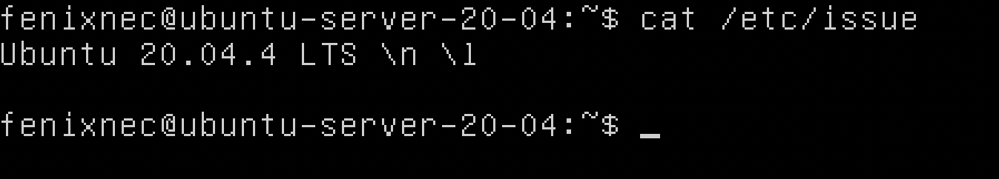

## Part 1. Установка OS
### Установка Ubuntu 20.04 Server LTS без графической оболочки:

## Part 2. Создание пользователя
#### Создать пользователя, отличного от пользователя, который создавался при установке. Пользователь должен иметь разрешение на прочтение логов из папки /var/log.
        
    
     $sudo useradd -G adm -s /bin/bash -m new_user
     $cat /etc/passwd

## Part 3. Настройка сети OS
#### 3.1. Изменение имени пользователя на user-1:
     $ sudo nano /etc/hostname -> переписывает хост-имя
     $ sudo nano /etc/hosts -> переписывает хост-файл
     $ sudo reboot -> перезагружает систему
     $ hostname -> проверка нового имени

#### 3.2. Установка временной зоны:
     $ timedatectl -> просмотр установленной временной зоны
     $ ls -l /etc/localtime -> или проверить временную зону из файла
     $ cat /etc/timezone -> этот файл также содержит инфу о временной зоне
     $ timedatectl list-timezones -> просмотр листа со всеми временными зонами
     $ sudo timedatectl set-timezone Europe/Moscow -> установка новой временной зоны

#### 3.3. Вывод названия сетевых интерфейсов с помощью консольной команды:
     $ ip link -> все названия (не показывает IP адрес)
     $ ip a -> показывает имена сетевых интерфейсов и IP адреса
     lo (loopback inerface) локальный интерфейс, созданный операционной системой. Только компьютер может увидеть этот интерфейс.

#### 3.4. Использование консольной команды для получения IP адреса устройства:
     $ ip r -> показывает динамический IP адрес через DHCP
     DHCP - Dynamic Host Configuraion Protocol(протокол динамической настройки узла).

#### 3.5. Внешний ip-адрес шлюза (IP) и внутренний IP-адрес шлюза, он же IP-адрес по умолчанию (gw):
     $ nslookup localhost -> внутренний IP адрес(gw);
     $ wget -O - -q icanhazip.com -> вшнешний IP адрес(ip);
     $ ip addr -> используется для отображения и изменения адресов протокола (IP, IPv6)

#### 3.6. Установка статического IP, gw, dns настройки и ping 8.8.8.8 + ya.ru:
     /etc/network/interfaces -> просмотр настроек сети
     $ ip route show match 0/0 -> проверка текущего адреса шлюза
     $ sudo addr add 10.0.2.16/24 broadcast 10.0.2.255 dev enp0s3 -> IP адрес, настройки трансляции
     $ sudo ip route add default via 10.0.2.2

     $ ping 8.8.8.8

     $ ping ya.ru

## Part 4. Обновление OS
#### 4.1. Обновить системные пакеты до последней на момент выполнения задания версии:
     $ sudo apt-get update -> обновление информации о пакетах
     $ sudo apt-get upgrade -> обновление пакетов
     Также можно использовать $sudo apt-get dist-upgrade

## Part 5. Использование команды sudo
#### 5.1. Разрешить пользователю, созданному в Part 2, выполнять команду sudo:
     ✮ sudo - предоставляет возможность пользователям выполнять команды от имени суперпользователя root

     $ sudo usermod -aG sudo new_user -> give root right to new_user
     $ su - new_user -> Now we are new_user (switch user)
     $ sudo nano /etc/hostname 
     $ sudo nano /etc/hosts
     $ sudo reboot
     $ hostname

     
## Part 6. Установка и настройка службы времени
#### 6.1. Настройка службы автоматической синхронизации времени:

     $ sudo apt-get install ntp -> установка пакетов
     $ sudo apt install systemd-timesyncd -> установка NTP
     $ sudo nano /etc/ntp.conf: (изменение серверов синхронизации) в конце файла добавляем сервера ниже
          server ru.pool.ntp.org
          server pool.ntp.org
          server time.nist.gov
          server ntp.psn.ru
          server ntp1.imvp.ru
     $ sudo nano /etc/rc.conf - Настраиваем автоматическую синхронизацию при каждой загрузке ОС.
       ntpd_enable=»YES» - редактируем ntpd_enable.
     $ sudo timedatectl set-ntp true -> активация NTP
     $ sudo systemctl unmask systemd-timesyncd.service -> служба замаскирована, что означает, что она не может быть запущена -> исп. unmask
     $ sudo service ntp restart -> перезапуск сервиса
     $ timedatectl show

     links sources: [Unmasked systemd](https://www.ubuntututorials.org/failed-to-set-ntp-not-supported/), 
[Short instruction](https://itshaman.ru/articles/257/sinkhronizatsiya-vremeni-cherez-internet-v-ubuntu)

## Part 7. Установка и использование текстовых редакторов (ВОТ ТУТ МЫ И ОСТАНОВИЛИСЬ!)
#### 7.1. Написать свой никнейм в VIM, NANO, MCEDIT:

     ----NANO----
     $ sudo nano test_nano.txt
     $ ctrl + x -> y -> enter - сохранить изменения в файле при работе в NANO

     ----VIM----
     $ sudo vim test_vim.txt
     $ esc -> shift + : -> wq - сохранить изменения в файле при работе в VIM

     ----MCEDIT----
     $ sudo apt-get install -y mcedit -> установка mcedit
     $ sudo mcedit test_mcedit.txt
     $ esc or 'Fn' + 'F10' -> сохранить изменения в файле при работе в MCEDIT: yes

NANO

VIM

MCEDIT

#### 7.2. Закрытие файла без сохранения изменений в VIM, NANO, MCEDIT:

     ----NANO----
     $ ctrl + x -> n -> enter - не сохранять изменения в файле при работе в NANO

     ----VIM----
     $ esc -> shift + : -> q! - не сохранять изменения в файле при работе в VIM

     ----MCEDIT----
     $ esc or 'Fn' + 'F10' -> не сохранять изменения в файле при работе в MCEDIT: No

NANO

VIM

MCEDIT

#### 7.3. Отредактировать файл ещё раз (по аналогии с предыдущим пунктом, а затем освоить функции поиска по содержимому файла (слово) и замены слова на любое другое:

----NANO---- \
sudo nano test_nano.txt -> открыть и изменить на "21 school 21"

В nano 'ctrl' + 'W' -> поиск слова

В nano зажать 'ctrl' + 'back slash' и написать '21' для поиска и нажать 'Enter'

----VIM---- \
sudo vim test_vim.txt -> открыть и изменить на "21 school 21"

В vim зажать 'shift' + ':' и написать \21 и нажать 'Enter' -> поиск слова. Нажатие 'n' переводит на след. слово

В vim нажать 'shift' + ':' и написать %s/21/69/g и нажать 'Enter' -> поиск и замена
    % -> диапазон от первой до последней строки файла
    g -> заменить все вхождения шаблона поиска в текущей строке

----MCEDIT----
$ sudo mcedit test_mcedit.txt -> открыть и изменить на "21 school 21"
Поиск -> 'Fn' + 'F7'

Замена -> 'Fn' + 'F4' -> написать слово для поиска и слово для замены, затем нажать 'Enter'

## Part 8. Установка и базовая настройка сервиса SSHD
#### 8.1. Установка службы SSHD:

     $ sudo apt update
     $ sudo apt install openssh-server
     $ sudo systemctl status ssh -> проверка работы SSH

#### 8.2. Добавить автостарт службы при загрузке системы:

     $ sudo systemctl enable sshr
     $ ssh localhost -> проверка работоспособности утилиты

#### 8.3. Перенастроить службу SSHd на порт 2022:

     $ sudo nano /etc/ssh/sshd_config -> установка настроек в файле конфигурации

#### 8.4. Показать наличие процесса sshd используя команду ps:

#### 8.5. Перезагрузка системы и использование netstat -tan:

     $ sudo reboot -> перезагрузка системы
     $ sudo apt install net-tools -> установка net-tools
     $ netstat -tan -> мониторинг сетей TCP / IP, который может отображать таблицы маршрутизации, фактические сетевые подключения и информацию о состоянии каждого устройства сетевого интерфейса.

       -t -> Состояние соединения по протоколу передачи;
       -a -> показать все соединения;
       -n -> использовать IP-адрес напрямую, а не через сервер доменных имен.

#### Значение каждого столбца
          ✮ Proto: протокол, используемый сокетом
          ✮ Recv-Q: количество байтов, не скопированных пользовательской программой, подключенной к этому сокету.
          ✮ Send-Q: количество неподтвержденных байтов удаленного хоста
          ✮ Локальный адрес: локальный адрес (имя локального хоста) и номер порта сокета. 
          ✮ Внешний адрес: удаленный адрес (имя удаленного хоста) и номер порта сокета.
          ✮ State: состояние сокета.
     Форма «0.0.0.0» — это стандартный способ сказать «нет конкретного адреса», все адреса IPv4 на локальном компьютере.

## Part 9. Установка и использование утилит top, htop
#### 9.1. По выводу команды top определить и записать в отчет:
     $ sudo apt-get update
     $ sudo apt-get install top
     $ sudo apt-get install htop
     $ top -> run top

     ✮ uptime -> 22:01
     ✮ number of authorised users -> 1 user
     ✮ total system load -> load average: 0.00, 0.05, 0.05
     ✮ total number of processes -> Tasks: 105 total
     ✮ cpu load -> 100 - id = 100 - 99.3 = 0.7 %
     ✮ memory load -> 516.1 + 144.6 = 725.3
     ✮ PID процесса с наибольшим потреблением памяти -> PID = 642 (Определили по %MEM)
     ✮ PID процесса занимающего наибольшее время CPU -> PID = 1 (Определили по TIME+)

#### 9.2. В отчёт вставить скрин с выводом команды htop:

✮ Sort PID

✮ Sort %CPU

✮ Sort %MEM

✮ Sort TIME+

✮ Filter SSHD

✮ Search syslog process

✮ Add info bar

## Part 10. Использование утилиты fdisk
#### Запустить команду fdisk -l:
     $ sudo fdisk -l | less
       name: /dev/sda;
       capacity: 10 GiB;
       number of sectors: 20971520;
       swap total - 1.7Gb, used - 0B, free - 1.7Gb
## Part 11. Использование утилиты df
     $ df /
       partition size: 9299276 kilobytes
       space used: 4820512 kilobytes
       space free: 3984788 kilobytes
       percentage used: 55%

     $ df -Th
       partition size: 8.9 Gigabyte
       space used: 4.6 Gigabyte
       space free: 3.9 Gigabyte
       percentage used: 55%
       Type: ext4
       
## Part 12. Использование утилиты du
$sudo du -sh /var/log /var /home -> Вывести размер папок /home, /var, /var/log

$sudo du -sh /var/log/* -> Вывести размер всего содержимого в /var/log

## Part 13. Установка и использование утилиты ncdu

     $ sudo apt-get update
     $ sudo apt-get install ncdu

$ sudo ncdu /

$ sudo ncdu /var

## Part 14. Работа с системными журналами
     $ sudo cat /var/log/auth.log | less
       ✮ the last successful login time: Aug 20 15:08:30;
       ✮ user name: fenixnec;
       ✮ login method: fenixnec(uid = 0);
     $ sudo service sshd restart -> перезапуск сервиса SSHD
     $ sudo cat /var/log/syslog | less - > проверка последних логов

## Part 15. Использование планировщика заданий CRON
#### 15.1. Запустить команду uptime через каждые 2 минуты:

sudo crontab -e -> записать задание для планировщика

sudo crontab -l \ -> показать список заданий

sudo crontab -r -> удаление задач

sudo crontab -l -> показать список заданий

