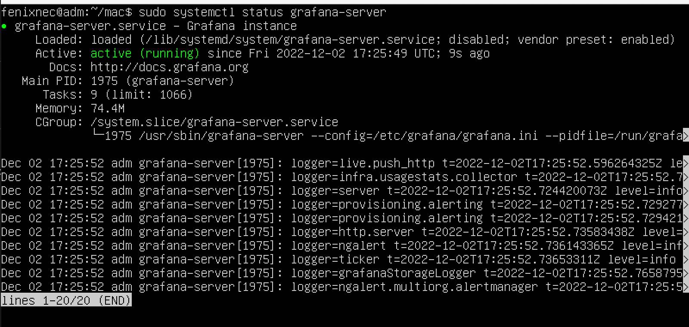
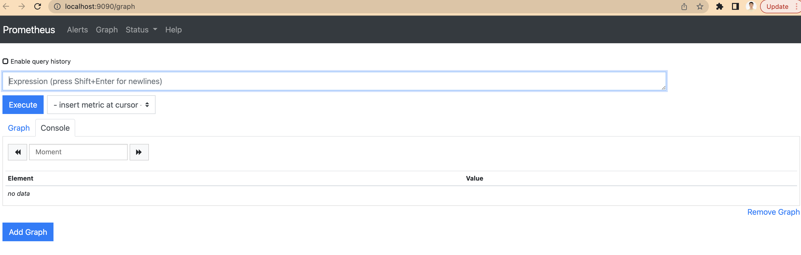
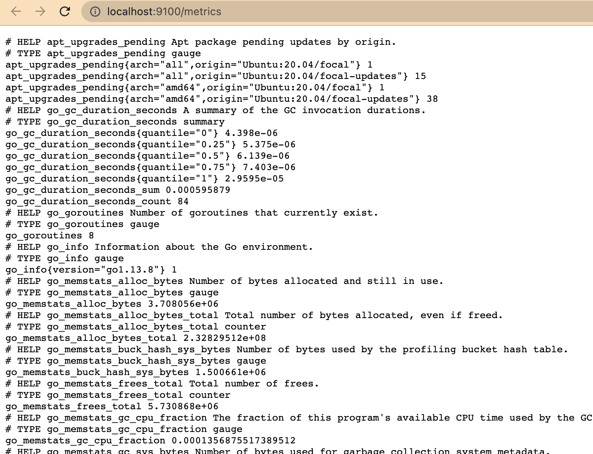
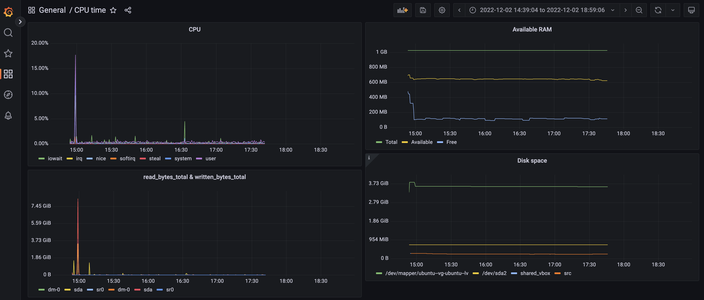
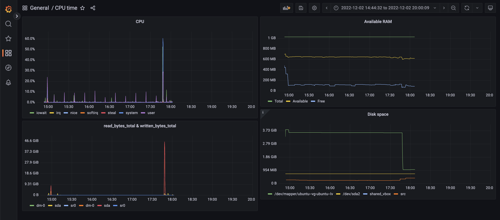
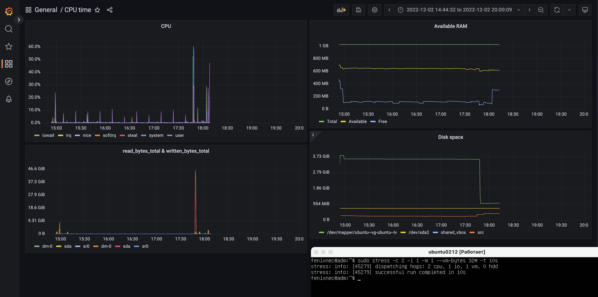

## Part 7. **Prometheus** и **Grafana**

### **Grafana** 
##### Скачиваем установочный файл графаны по ссылке(https://dl.grafana.com/oss/release/grafana_9.2.4_amd64.deb)
##### Cделать общую папку с локальной машиной (https://medium.com/macoclock/share-folder-between-macos-and-ubuntu-4ce84fb5c1ad)
##### Запускаем след команды с общей папки:
##### `sudo apt install ./grafana_9.2.3_amd64.deb`
##### `sudo systemctl daemon-reload`
##### `sudo systemctl start grafana-server`
##### `sudo systemctl status grafana-server`
##### Сервер Grafana запущен

#
## **Prometheus** 
##### `sudo apt install prometheus`
#
##### Получить доступ к веб интерфейсам **Prometheus** и **Grafana** с локальной машины
#
### Перходим по ссылкам
### http://localhost:3000

#
### http://localhost:9090/graph

#
### http://localhost:9100/metrics

#

#
##### Добавить на дашборд **Grafana** отображение ЦПУ, доступной оперативной памяти, свободное место и кол-во операций ввода/вывода на жестком диске
#
## До запуска скрипта

#
### Запустить ваш bash-скрипт из [Части 2](#part-2-засорение-файловой-системы)
#
##### Посмотреть на нагрузку жесткого диска (место на диске и операции чтения/записи)
#

#
### Установить утилиту **stress** и запустить команду `stress -c 2 -i 1 -m 1 --vm-bytes 32M -t 10s`
##### Посмотреть на нагрузку жесткого диска, оперативной памяти и ЦПУ
#

#

