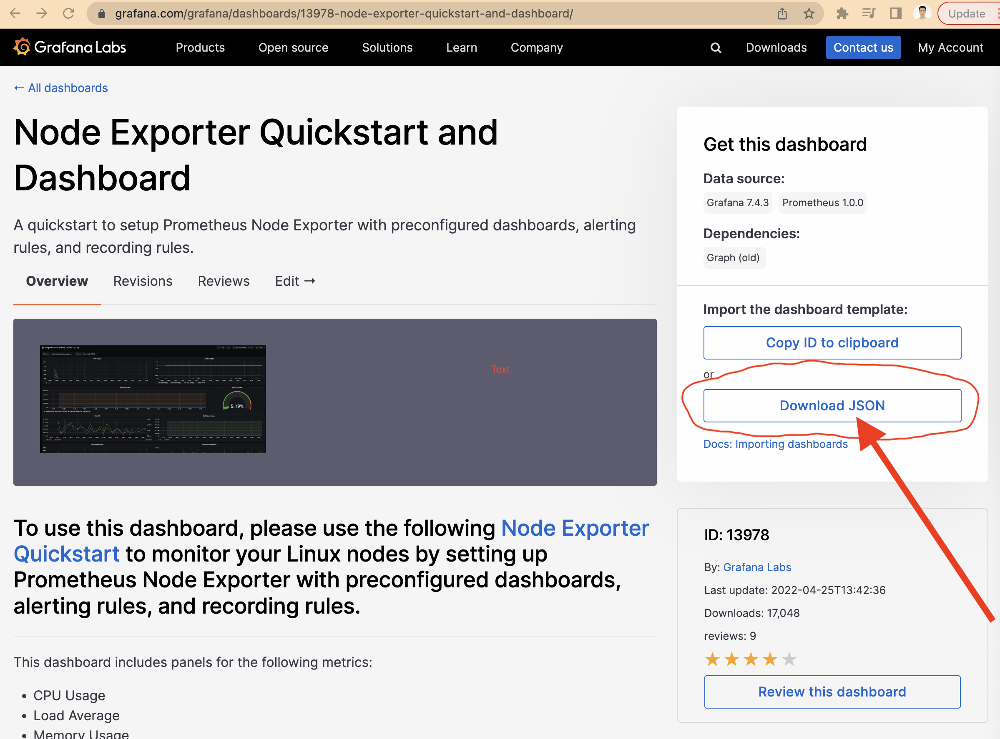
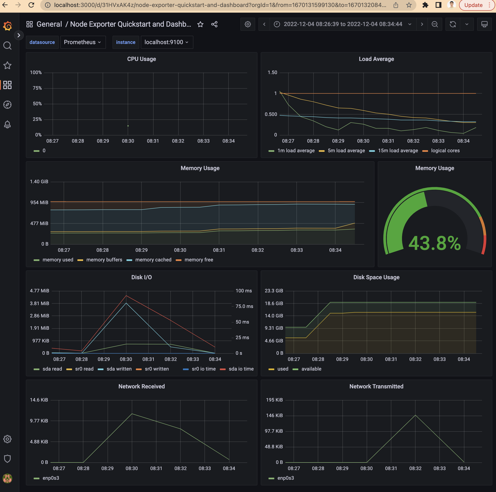
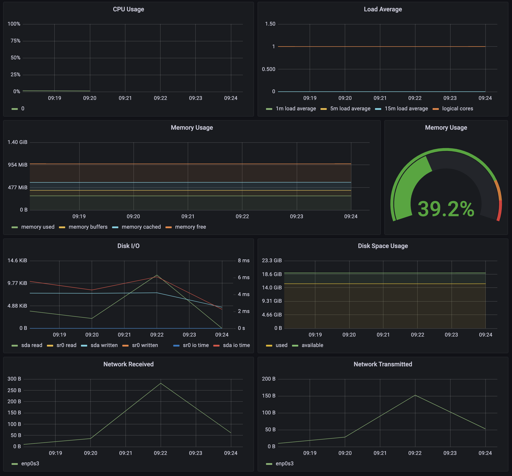
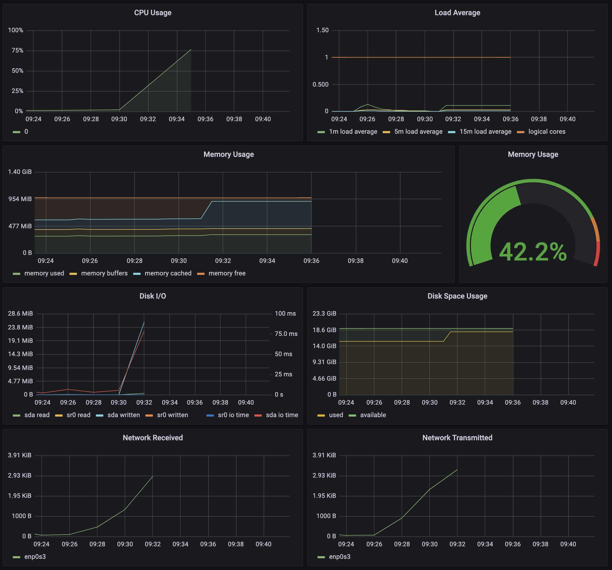
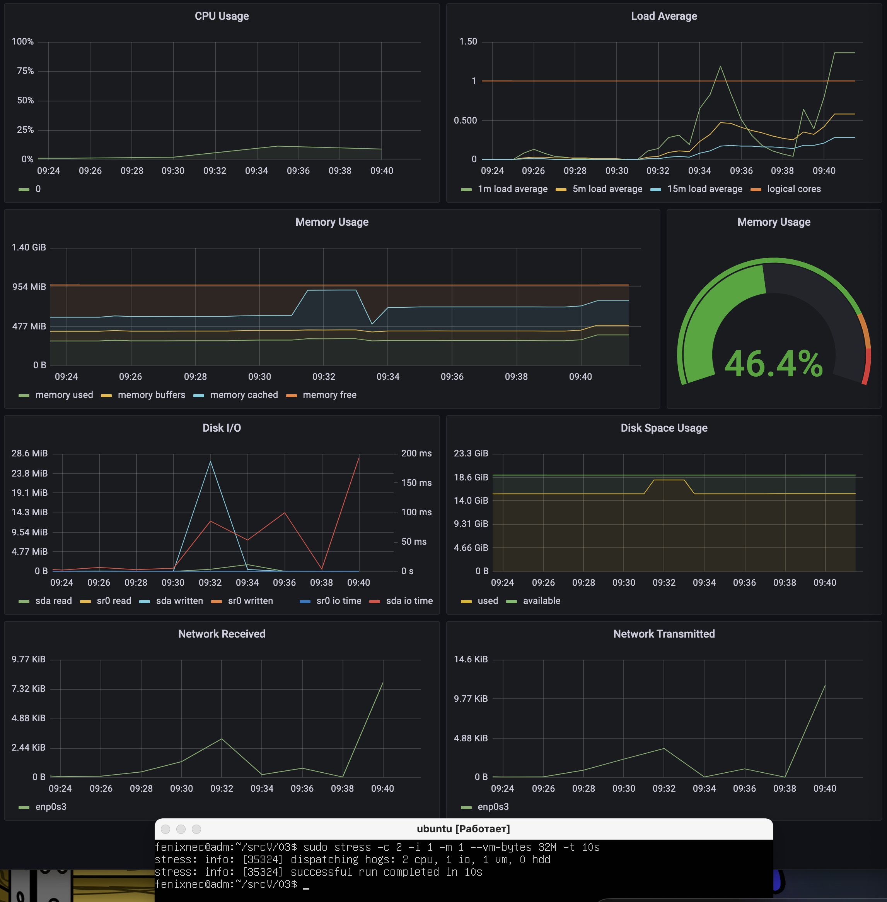
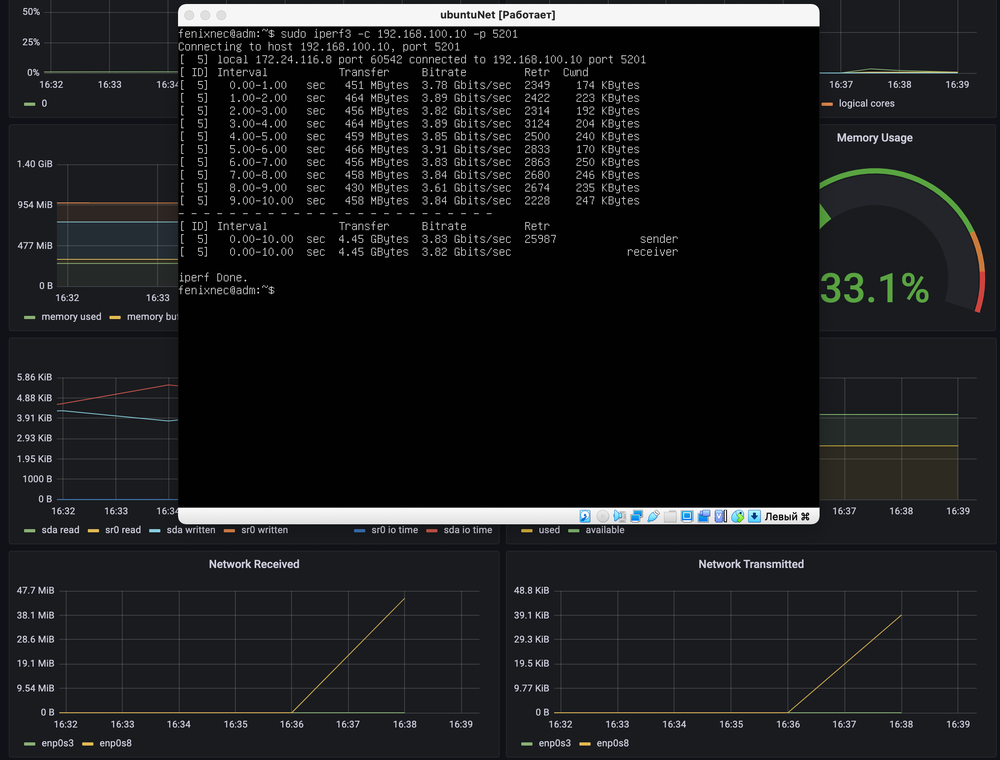

## Part 8. Готовый дашборд

### **Grafana** 
##### Установить готовый дашборд Node Exporter Quickstart and Dashboard с официального сайта Grafana Labs
#####  Ссылка на сайт (https://grafana.com/grafana/dashboards/13978-node-exporter-quickstart-and-dashboard/)

#### В Графане: 
#### Кликаем Dashboards->Browse
#### Выбираем в вкладке New -> Import
#### Кликаем Upload JSON file и загружаем скаченный ранее json файл
#### Кликаем Import 
#### Должно получиться страница с готвым дашбордом:

#

##### Провести те же тесты, что и в Части 7

## До запуска скрипта

#
### Запустить ваш bash-скрипт из [Части 2](#part-2-засорение-файловой-системы)
##### Посмотреть на нагрузку жесткого диска (место на диске и операции чтения/записи)
#

#
### Установить утилиту **stress** и запустить команду `stress -c 2 -i 1 -m 1 --vm-bytes 32M -t 10s`
##### Посмотреть на нагрузку жесткого диска, оперативной памяти и ЦПУ
#

#
##### Запустить ещё одну виртуальную машину, находящуюся в одной сети с текущей

##### Запустить тест нагрузки сети с помощью утилиты iperf3

##### Посмотреть на нагрузку сетевого интерфейса

#
