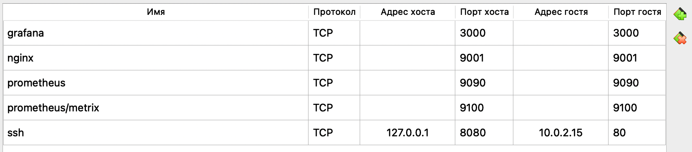
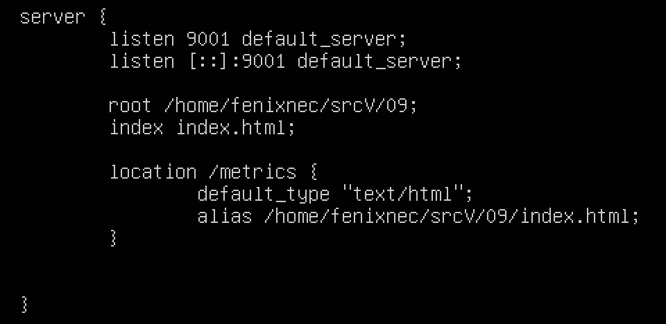
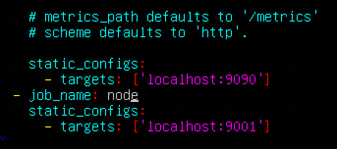
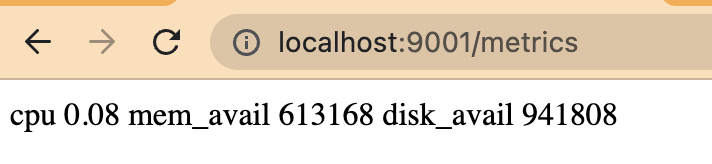
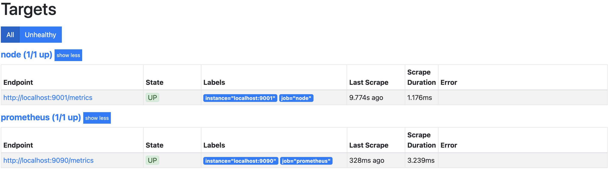
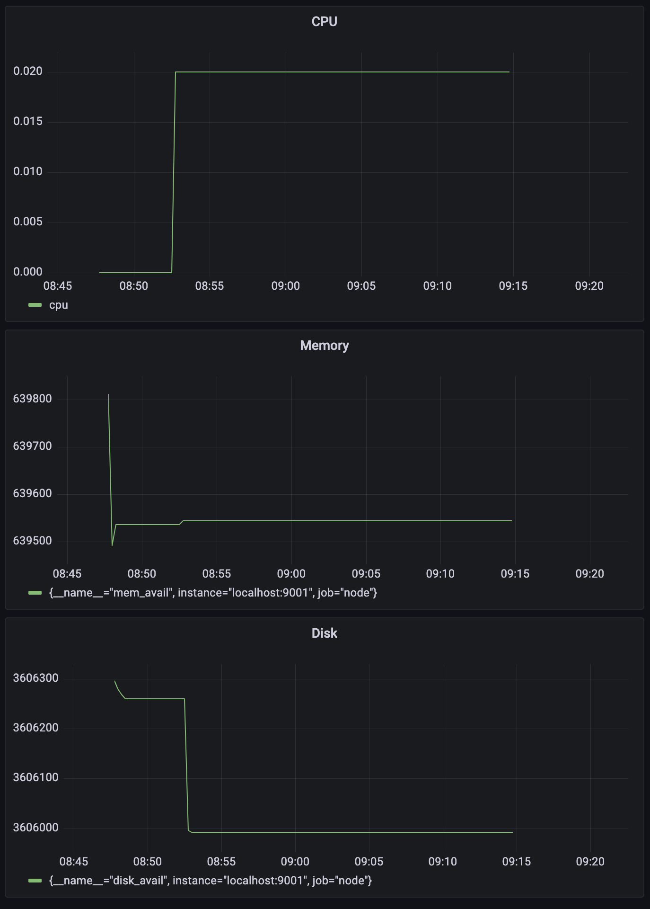
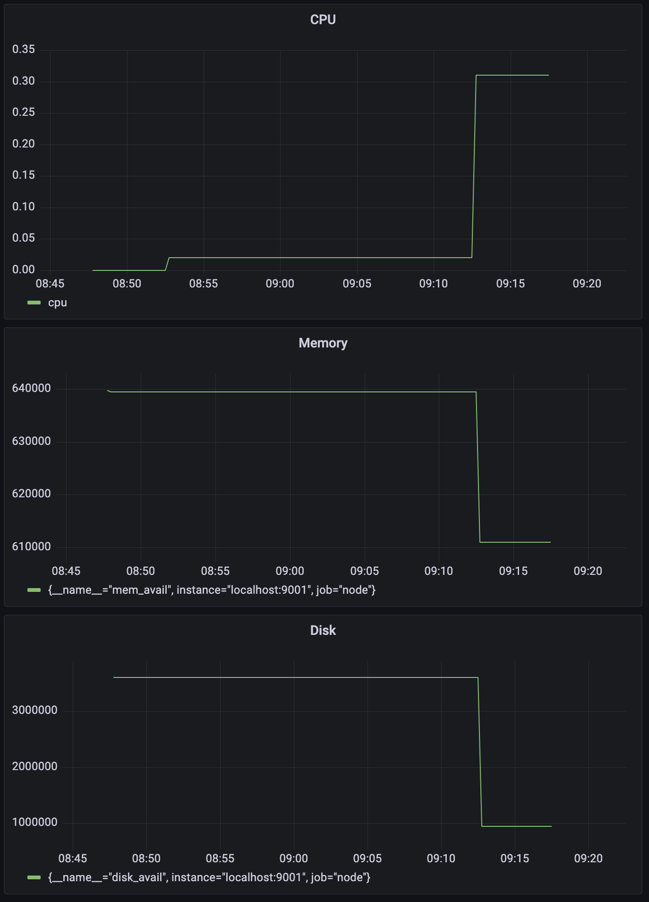
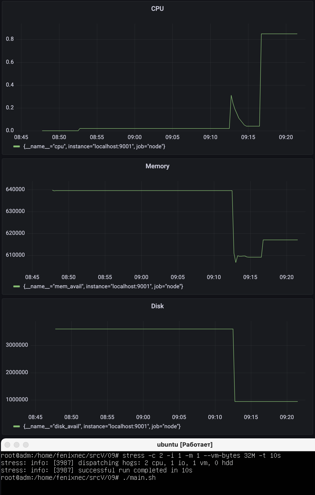

## Part 9. Дополнительно. Свой node_exporter

### **Порты** 

#

### /etc/nginx/nginx.conf

#

### /etc/prometheus/prometheus.yml

#

### http://localhost:9001/metrics

#

### http://localhost:9090/targets

#

### Провести те же тесты, что и в Части 7
#### До запуска скрипта

#

#
#### Test bash-скрипт

#

#
#### Test stress

#
