## Part 3. Мини веб-сервер
#### 3.1 Mини сервер на C и FastCgi, который будет возвращать простейшую страничку с надписью Hello World!
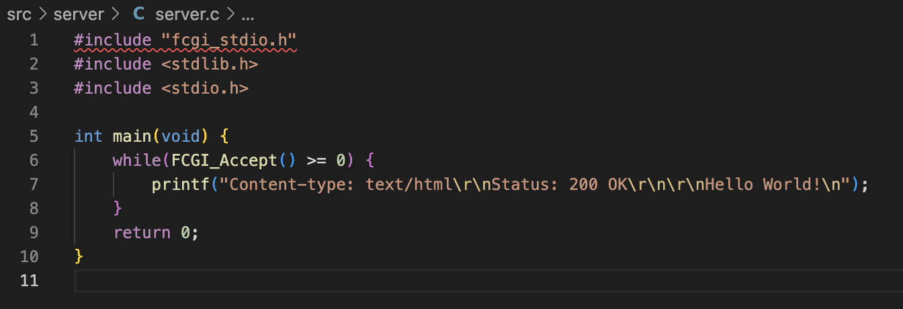
####
#### 3.2 Cвой nginx.conf, который будет проксировать все запросы с 81 порта на 127.0.0.1:8080
#### Добавляем новый контекст(раздел) server с директивами.
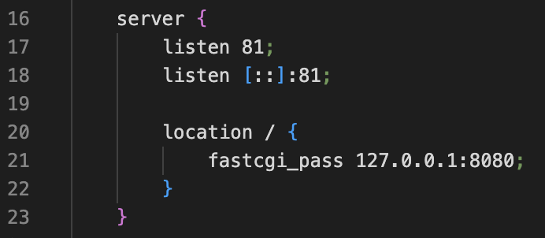
#### 3.3 Выкачываем и запускаем nginx.
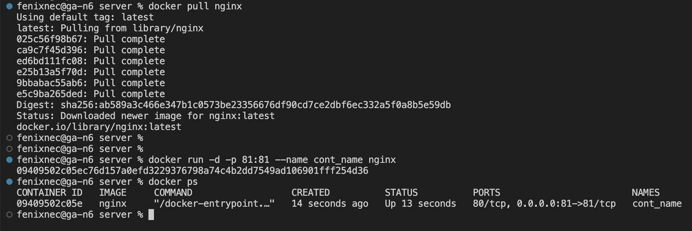
#### 3.4 Копируем файлы server.c и nginx.conf в контейнер.
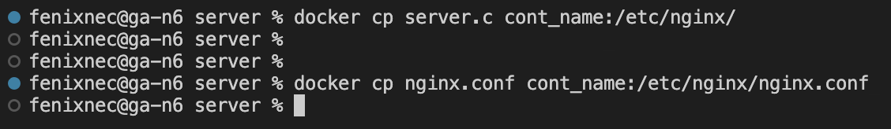
#### 3.5 Вход в внутрь контейнера и проверка файлов.
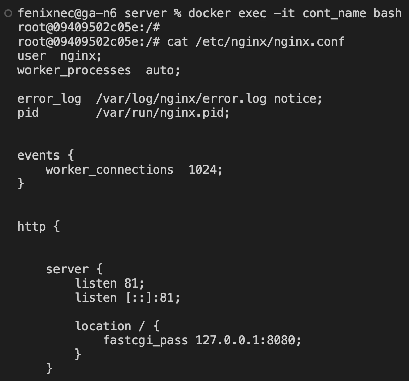
#### ...
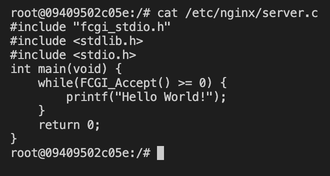
#### 3.6 Обновление контейнера. Установка gcc, spawn-dcgi, libfcgi-dev.
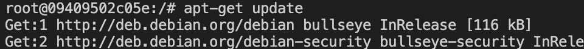
#### ...
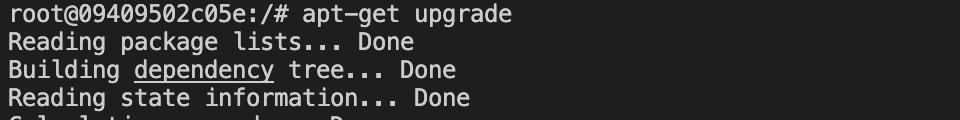
#### ...
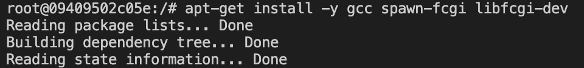
#### ...
####
#### 3.7 Компиляция и запуск сервера через spawn-fcgi на порту 8080
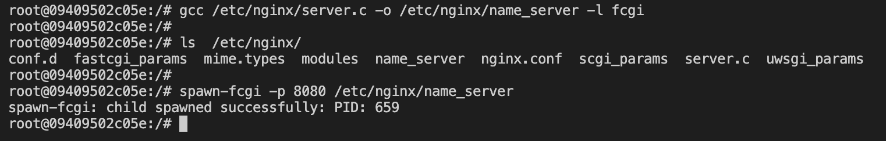
####
#### 3.8 Перезапуск nginx и проверка на http://localhost:81/
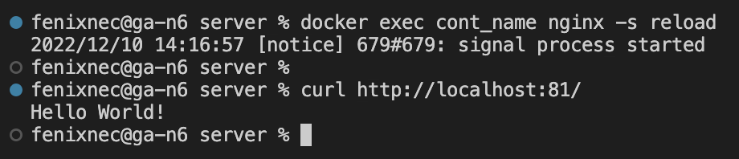
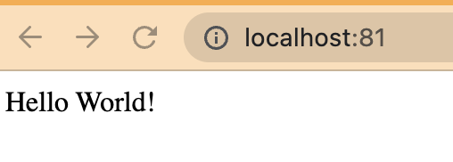
####
#### 3.9 Положить файл nginx.conf по пути ./nginx/nginx.conf (это понадобится позже)
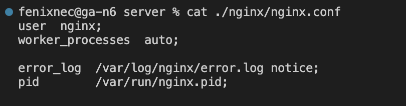
####
#
#### -----------------------------------------------------------------------------------------------------
#
####

## Part 4. Свой докер
####
####
#### Dockerfile
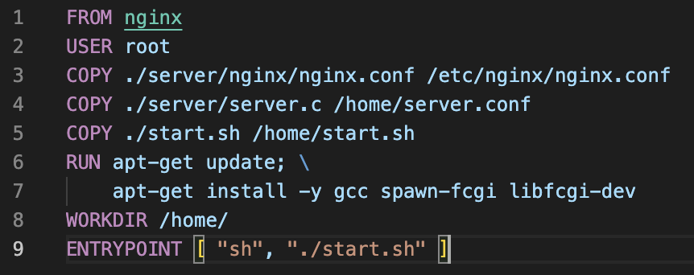
#### Скрипт start.sh для запуска из докера.
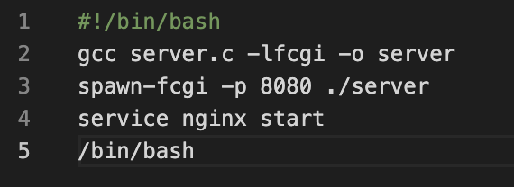
#### Собрать написанный докер образ через docker build при этом указав имя и тег
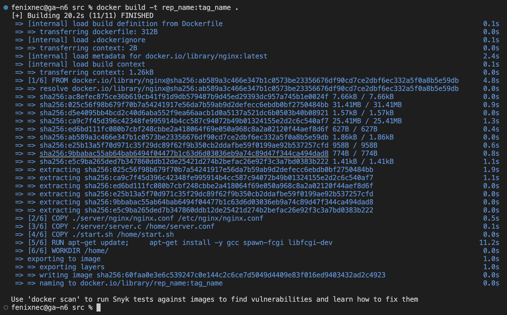
#### Проверить через docker images, что все собралось корректно
#### Запустить собранный докер образ с маппингом 81 порта на 80 на локальной машине и маппингом папки ./nginx внутрь контейнера по адресу, где лежат конфигурационные файлы nginx'а (см. Часть 2)
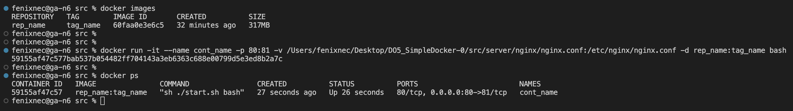
#### Проверить, что по localhost:80 доступна страничка написанного мини сервера
#### Дописать в ./nginx/nginx.conf проксирование странички /status, по которой надо отдавать статус сервера nginx
#### Перезапустить докер образ

#
#### -----------------------------------------------------------------------------------------------------
#
####
## Part 5. **Dockle**
####
#
#### -----------------------------------------------------------------------------------------------------
#
####
## Part 6. Базовый **Docker Compose**