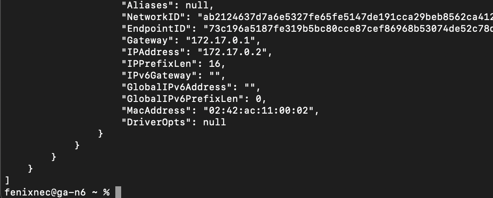

## Установка и запуск Docker
#### Переходим по ссылке скачиваем и устонавливаем Docker
#### (https://www.docker.com/products/docker-desktop/)
####
#### Линковка в goinfre
#### После установки очень **важно** не запускать приложение, иначе вы рискуете потерять все свободное место на диске, которое докер не постесняется скушать. Что бы этого избежать предварительно выполняем следующие команды:
#### `rm -rf ~/Library/Containers/com.docker.docker`
#### `mkdir -p ~/goinfre/Docker/Data`
#### `ln -s ~/goinfre/Docker ~/Library/Containers/com.docker.docker`
#### Это удалит папку с контейнерами докера в домашней директории и линканет ее в goinfre
#### После чего запускаем докер и ждем пока запустится(1-2мин).
#### Подробнее в Notion ссылке:
#### (https://21-school-by-students.notion.site/Docker-install-on-school-iMacs-9354ef106a8a40c6b46a69cea0a11bf8)
####
####

## Part 1. Готовый докер
####
#### 1.1 Взять официальный докер образ с nginx и выкачать его при помощи `docker pull`

####
#### 1.2 Проверить наличие докер образа через `docker images`

####
#### 1.3 Запустить докер образ через `docker run -d [image_id|repository]`

####
#### 1.4 Проверить, что образ запустился через `docker ps`

####
#### 1.5 Посмотреть информацию о контейнере через docker `inspect [container_id|container_name]`

#### ...

####
#### По выводу команды определить и поместить в отчёт: 
#### размер контейнера

####
#### список замапленных портов

####
#### ip контейнера

####
#### 1.6 Остановить докер образ через `docker stop [container_id|container_name]`
#### Проверить, что образ остановился через `docker ps`

####
#### 1.7 Запустить докер с замапленными портами `80 и 443` на локальную машину через команду `run`

####
#### 1.8 Проверить, что в браузере по адресу `localhost:80` доступна стартовая страница nginx

####
#### 1.9 Перезапустить докер контейнер через `docker restart [container_id|container_name]`
#### Проверить любым способом, что контейнер запустился

####
#
####

## Part 2. Операции с контейнером
#### 2.1 Прочитать конфигурационный файл `nginx.conf` внутри докер контейнера через команду `exec`

####
#### 2.2 Создать на локальной машине файл `nginx.conf`
#### 2.3 Настроить в нем по пути `/status` отдачу страницы статуса сервера nginx

####
#### 2.4 Скопировать созданный файл `nginx.conf` внутрь докер образа через команду `docker cp`
#### 2.5 Перезапустить nginx внутри докер образа через команду `exec`

####
#### 2.6 Проверить, что по адресу `localhost:80/status` отдается страничка со статусом сервера nginx

####
#### 2.7 Экспортировать контейнер в файл `container.tar` через команду `export`
#### 2.8 Остановить контейнер

####
#### 2.9 Удалить образ через `docker rmi [image_id|repository]`, не удаляя перед этим контейнеры

####
#### 2.10 Удалить остановленный контейнер

####
#### 2.11 Импортировать контейнер обратно через команду `import`

####
#### 2.12 Запустить импортированный контейнер
#### `docker run -d -p 80:80 -p 443:443 ff3d26a280f5`

####
#### 2.13 Проверить, что по адресу `localhost:80/status` отдается страничка со статусом сервера nginx

####
#
#### -----------------------------------------------------------------------------------------------------
#
####