## Part 1. Настройка **gitlab-runner**

#### Скачать и установить на виртуальную машину **gitlab-runner**
#### [Install GitLab Runner](https://docs.gitlab.com/runner/install/linux-repository.html)
#### `curl -L "https://packages.gitlab.com/install/repositories/runner/gitlab-runner/script.deb.sh" | sudo bash`
#### `sudo apt-get install gitlab-runner`
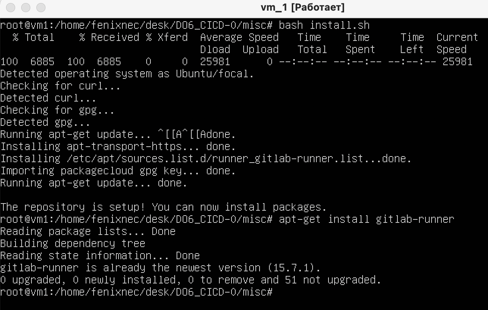
##### Запустить **gitlab-runner** и зарегистрировать его для использования в текущем проекте (*DO6_CICD*)
#### [Register a runner](https://docs.gitlab.com/runner/register/index.html)
`sudo gitlab-runner register`
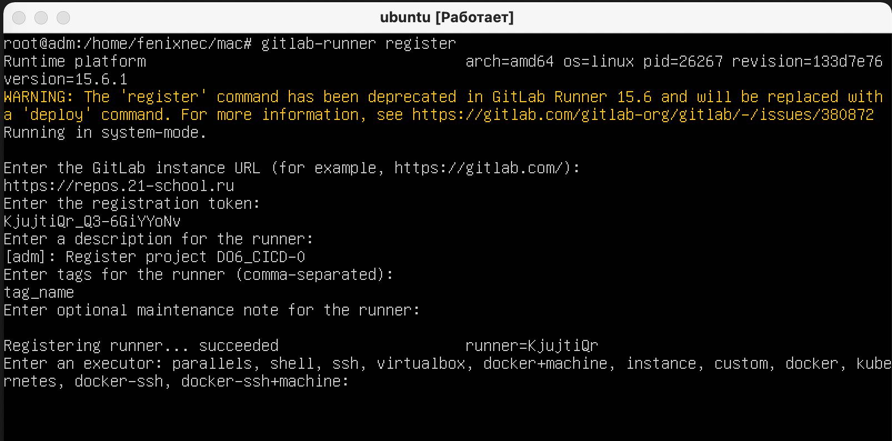

## Part 2. Сборка
### Написать этап для **CI** по сборке приложений из проекта *C2_SimpleBashScripts*:
#### В файле _gitlab-ci.yml_ добавить этап запуска сборки через мейк файл из проекта _C2_
#### Файлы, полученные после сборки (артефакты), сохранять в произвольную директорию со сроком хранения 30 дней.
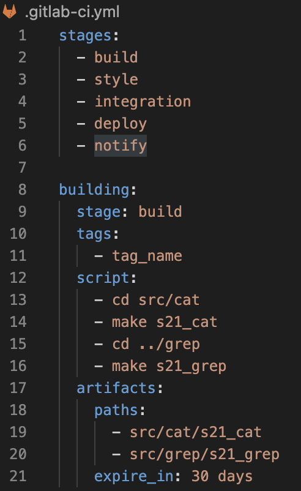
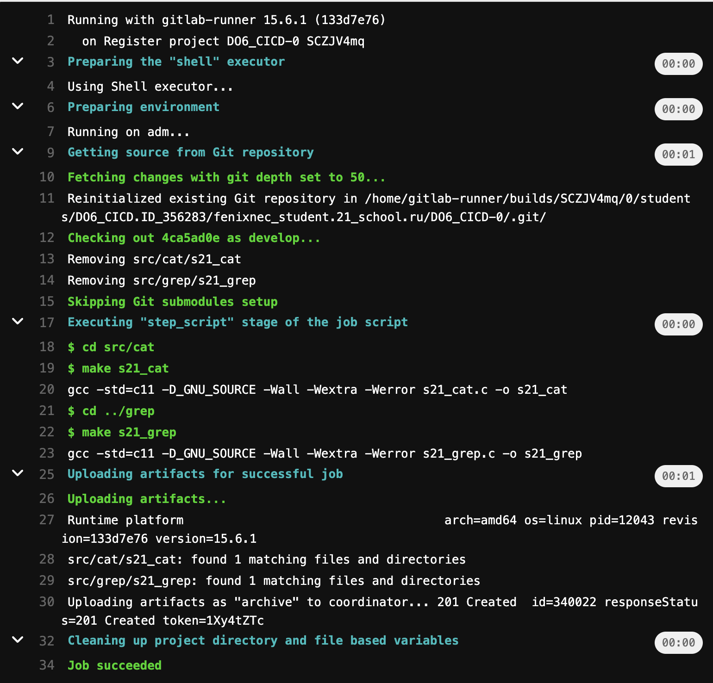

## Part 3. Тест кодстайла
### Написать этап для **CI**, который запускает скрипт кодстайла (*clang-format*):
#### Если кодстайл не прошел, то "зафейлить" пайплайн
#### В пайплайне отобразить вывод утилиты *clang-format*
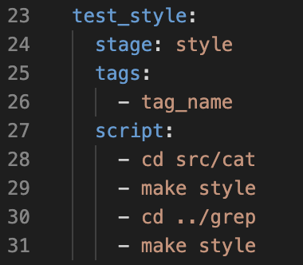
#
#### Failed style test 
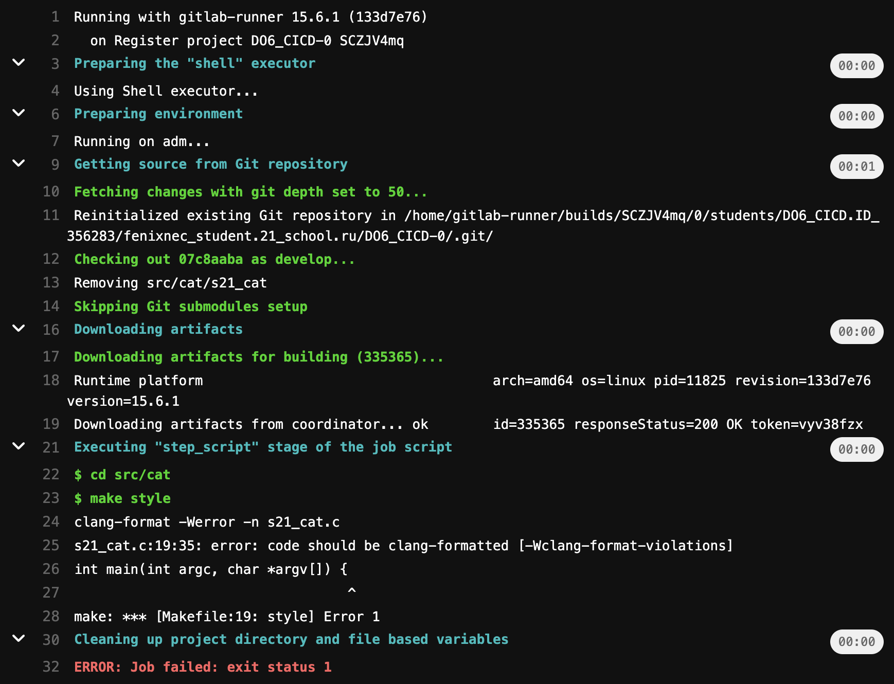
#
#### Success style test 
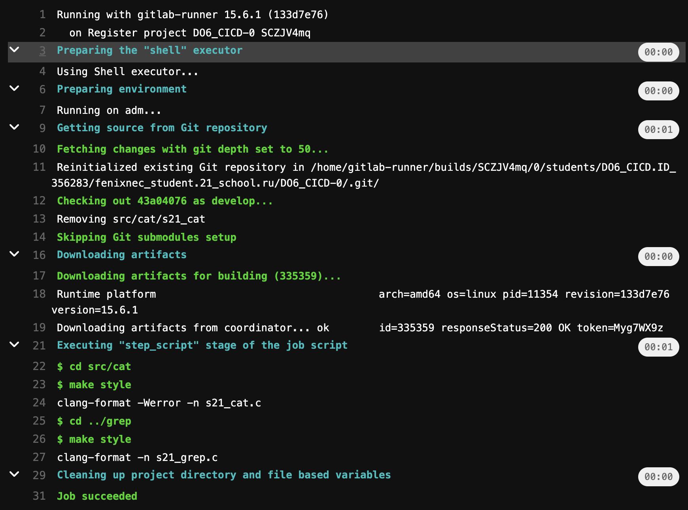

### Part 4. Интеграционные тесты

### Написать этап для **CI**, который запускает ваши интеграционные тесты из того же проекта:
#### Запускать этот этап автоматически только при условии, если сборка и тест кодстайла прошли успешно
#### Если тесты не прошли, то "зафейлить" пайплайн
#### В пайплайне отобразить вывод, что интеграционные тесты успешно прошли / провалились
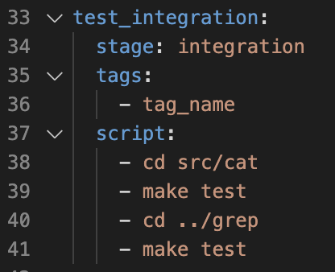
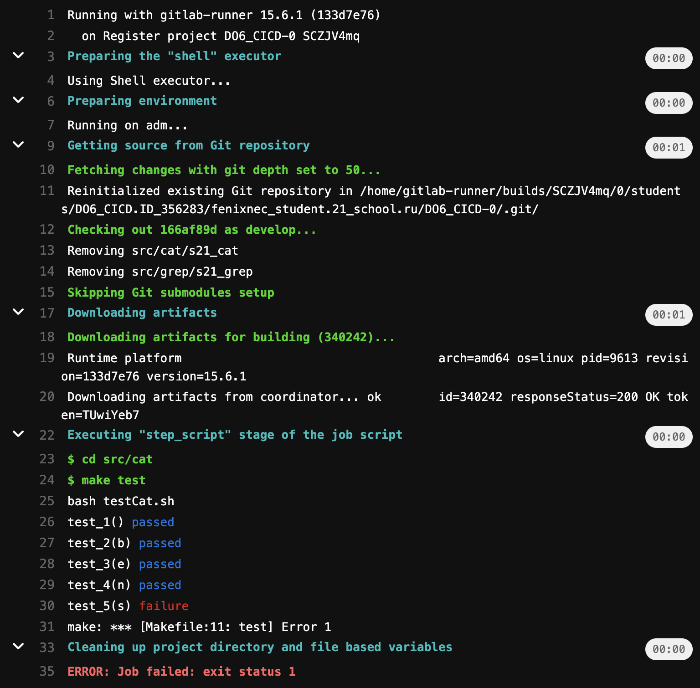
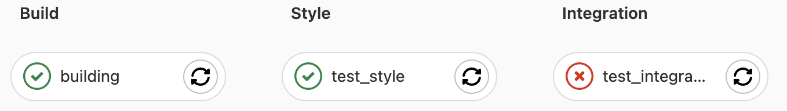
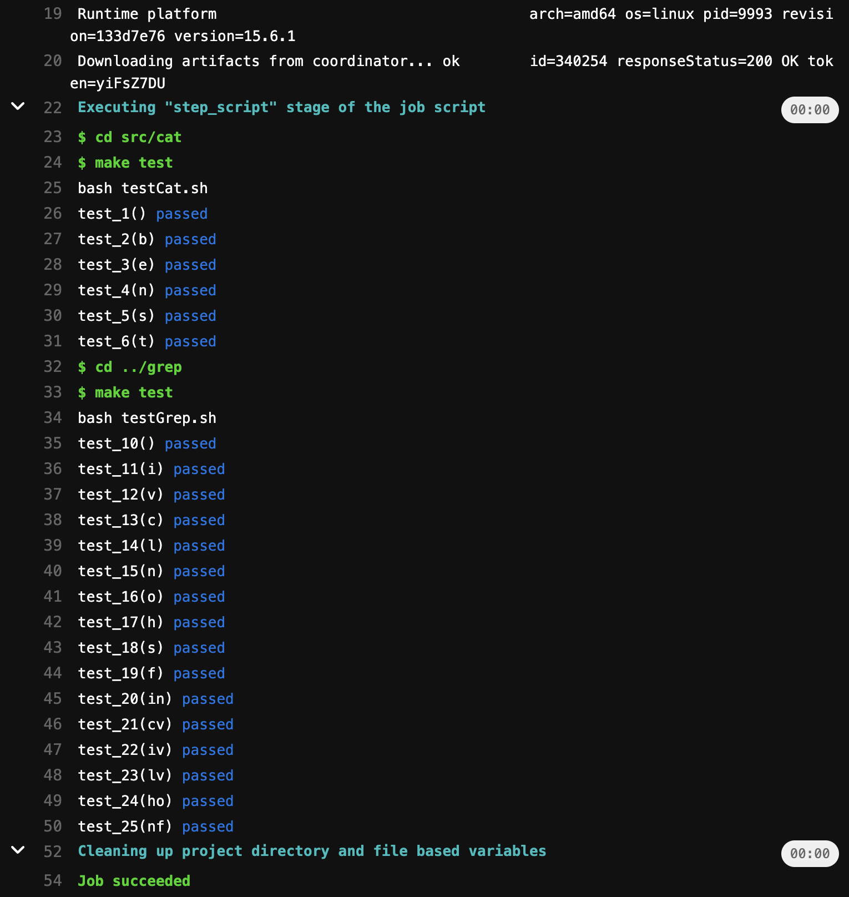

## Part 5. Этап деплоя

### Написать этап для **CD**, который "разворачивает" проект на другой виртуальной машине:
#### Запускать этот этап вручную при условии, что все предыдущие этапы прошли успешно
#### Написать bash-скрипт, который при помощи **ssh** и **scp** копирует файлы, полученные после сборки (артефакты), в директорию */usr/local/bin* второй виртуальной машины
#### В файле _gitlab-ci.yml_ добавить этап запуска написанного скрипта
#### В случае ошибки "зафейлить" пайплайн
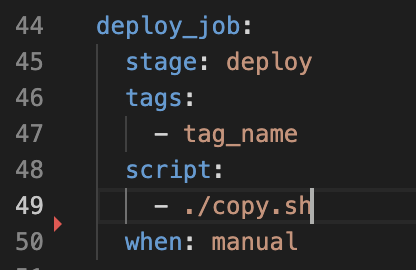
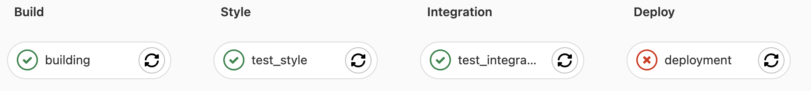
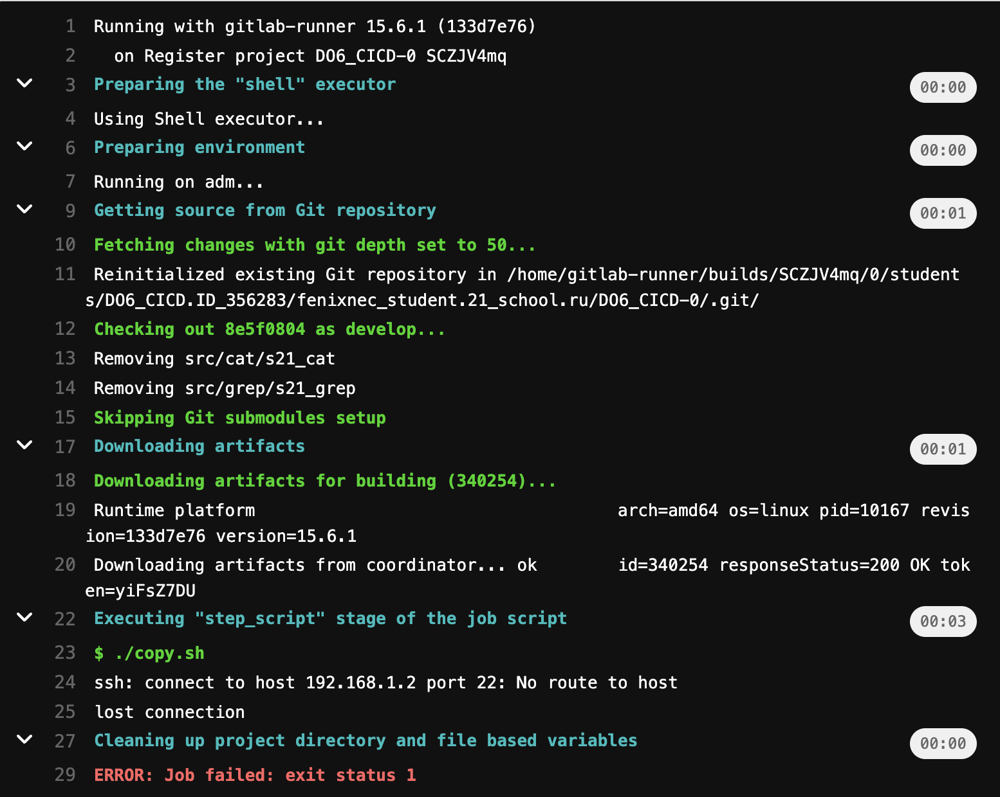
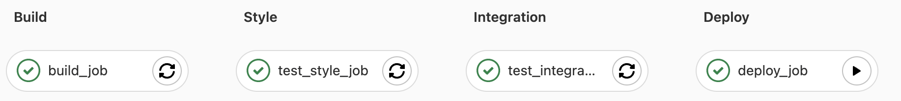
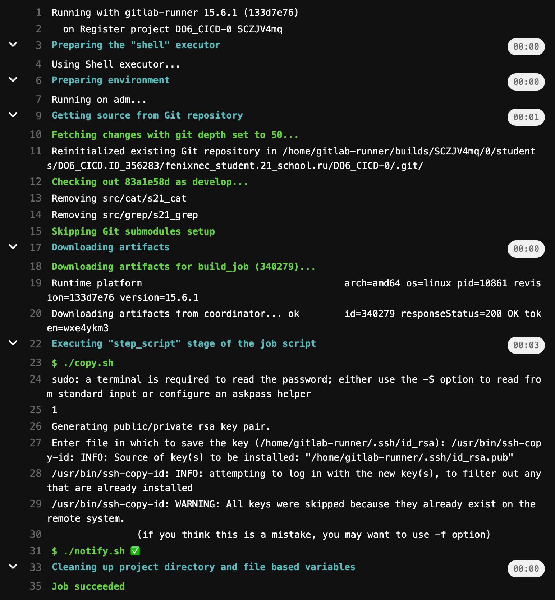

#### В результате вы должны получить готовые к работе приложения из проекта *C2_SimpleBashScripts* (s21_cat и s21_grep) на второй виртуальной машине.
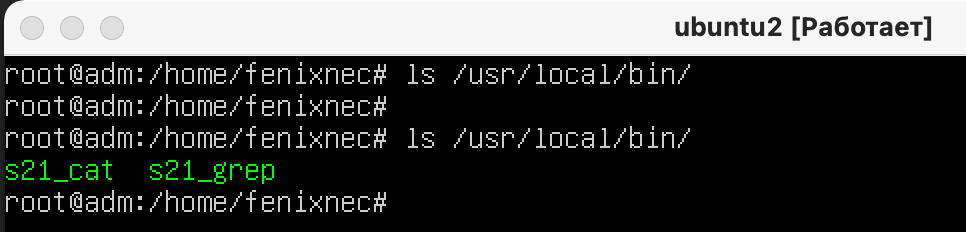

## Part 6. Дополнительно. Уведомления

#### Настроить уведомления о успешном/неуспешном выполнении пайплайна через бота с именем "[ваш nickname] DO6 CI/CD" в *Telegram*
#### - Текст уведомления должен содержать информацию об успешности прохождения как этапа **CI**, так и этапа **CD**.
#### - В остальном текст уведомления может быть произвольным.
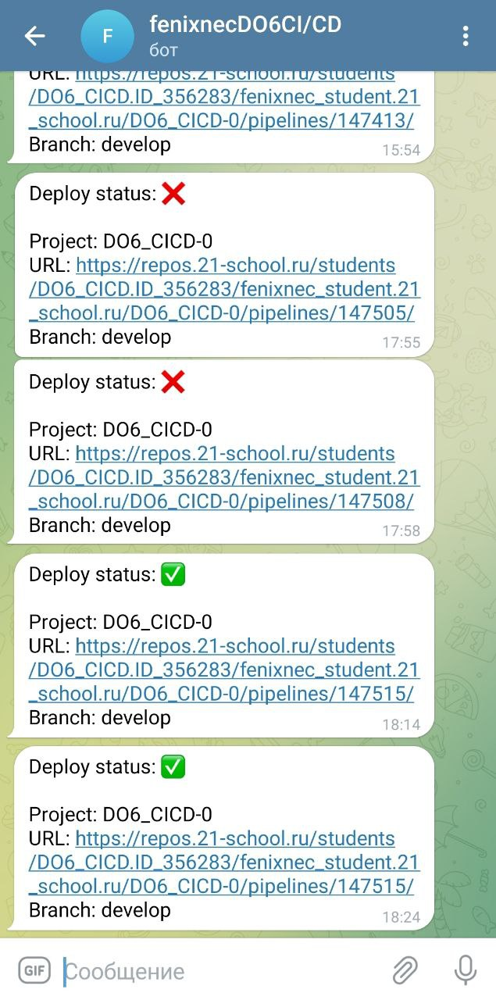
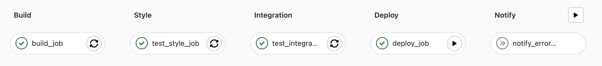
